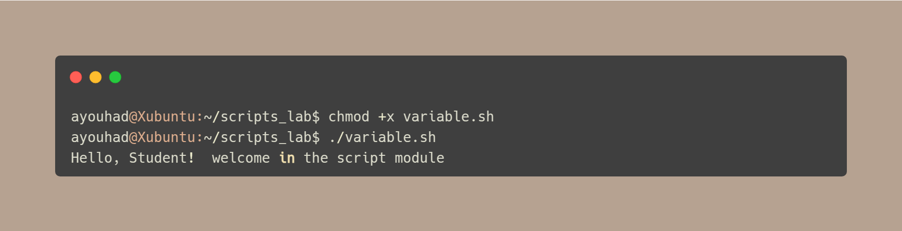
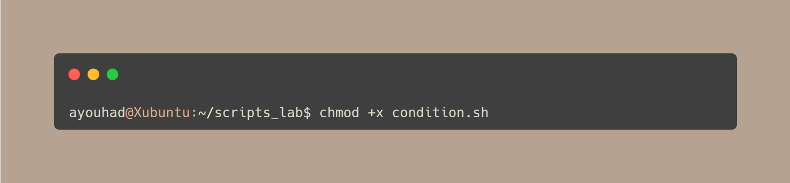

# 🐧 Linux Shell Scripting Workshop 

This workshop helped me get hands-on experience with writing and executing Bash scripts in a Linux environment.

### ✅ Here's what I did and learned:

- I created a working directory and wrote my **first Bash script** that prints a simple greeting.
- I learned how to make scripts **executable** using `chmod +x`.
- I worked with **variables** and made scripts interactive using the `read` command.
- I used **conditional statements** (`if`, `else`) to compare numbers and determine if a number is even or odd.
- I created **loops** using `for` to repeat actions, like displaying a multiplication table.
- I built a simple **automation script** to back up files into a user-specified directory.

These exercises helped me understand the structure of shell scripts and how they can be used to automate repetitive tasks in Linux.

---

## 🧰 Step 1: Prepare the Environment

1. Open the Linux terminal.
2. Create a directory for your scripts:

---

## 👋 Step 2: First Simple Script

### Script: `hello.sh`:

### Make the script executable and run it:

---

## 🧠 Step 3: Working with Variables

### Script: `variable.sh`:

### Run the script:

### Make it interactive:

---

## 🔍 Step 4: Using Conditions

### Script: `condition.sh`:

### Exercise :

**Modify the script to check if the number is even or odd:**

---

## 🔁 Step 5: Using Loops

### Script: `boucle.sh`:

### Run it :

### Exercise :

**Modify the script to check if the number is even or odd:**

---

## 💾 Step 6: Automating a Task

**Goal: Back up a file to a specific folder.**

### Script: `save.sh`:

### Run the script:

